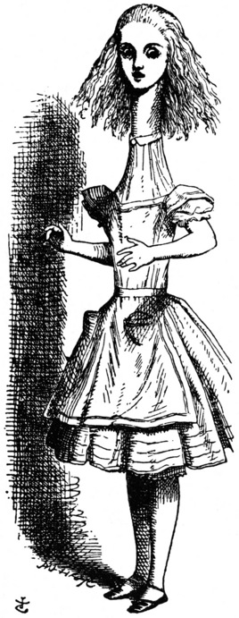
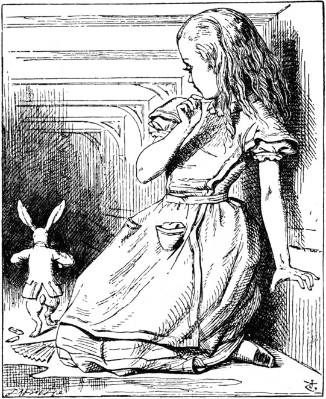
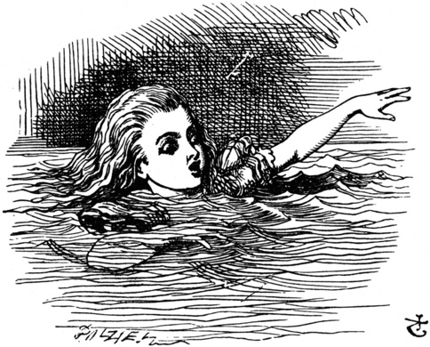
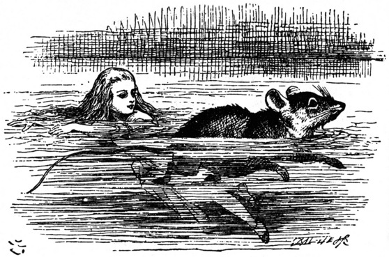

The Pool of Tears
=================

‘Curiouser and curiouser!’ cried Alice
(she was so much surprised, that for the moment she quite forgot how to
speak good English); ‘now I’m opening out like the largest telescope
that ever was! Good-bye, feet!’ (for when she looked down at her feet,
they seemed to be almost out of sight, they were getting so far off).
‘Oh, my poor little feet, I wonder who will put on your shoes and
stockings for you now, dears? I’m sure *I* sha’n’t be able! I shall be a
great deal too far off to trouble myself about you: you must manage the
best way you can; – but I must be kind to them,’ thought Alice, ‘or
perhaps they wo’n’t walk the way I want to go! Let me see: I’ll give
them a new pair of boots every Christmas.’

And she went on planning to herself how she would manage it. ‘They must
go by the carrier,’ she thought; ‘and how funny it’ll seem, sending
presents to one’s own feet! And how odd the directions will look!

~~~{.poem}
| Alice’s Right Foot, Esq.
|    Hearthrug,
|        near the fender,
|            (with Alice’s love).
~~~

Oh dear, what nonsense I’m talking!’

Just then her head struck against the roof of the hall: in fact she was
now more than nine feet high, and she at once took up the little golden
key and hurried off to the garden door.

Poor Alice! It was as much as she could do, lying down on one side, to
look through into the garden with one eye; but to get through was more
hopeless than ever: she sat down and began to cry again.

‘You ought to be ashamed of yourself,’ said Alice, ‘a great girl like
you,’ (she might well say this), ‘to go on crying in this way! Stop this
moment, I tell you!’ But she went on all the same, shedding gallons of
tears, until there was a large pool all round her, about four inches
deep and reaching half down the hall.

After a time she heard a little pattering of feet in the distance, and
she hastily dried her eyes to see what was coming. It was the White
Rabbit returning, splendidly dressed, with a pair of white kid gloves in
one hand and a large fan in the other: he came trotting along in a great
hurry, muttering to himself as he came, ‘Oh! the Duchess, the Duchess!
Oh! *Wo’n’t* she be savage if I’ve kept her waiting!’ Alice felt so
desperate that she was ready to ask help of any one; so, when the Rabbit
came near her, she began, in a low, timid voice, ‘If you please, sir—’
The Rabbit started violently, dropped the white kid gloves and the fan,
and skurried away into the darkness as hard as he could go.

Alice took up the fan and gloves, and, as the hall was very hot, she
kept fanning herself all the time she went on talking: ‘Dear, dear! How
queer everything is to-day! And yesterday things went on just as usual.
I wonder if I’ve been changed in the night? Let me think: *was* I the
same when I got up this morning? I almost think I can remember feeling a
little different. But if I’m not the same, the next question is, Who in
the world am I? Ah, *that’s* the great puzzle!’ And she began thinking
over all the children she knew that were of the same age as herself, to
see if she could have been changed for any of them.

‘I’m sure I’m not Ada,’ she said, ‘for her hair goes in such long
ringlets, and mine doesn’t go in ringlets at all; and I’m sure I ca’n’t
be Mabel, for I know all sorts of things, and she, oh! she knows such a
very little! Besides, *she’s* she, and *I’m* I, and – oh dear, how
puzzling it all is! I’ll try if I know all the things I used to know.
Let me see: four times five is twelve, and four times six is thirteen,
and four times seven is – oh dear! I shall never get to twenty at that
rate! However, the Multiplication Table doesn’t signify: let’s try
Geography. London is the capital of Paris, and Paris is the capital of
Rome, and Rome – no, *that’s* all wrong, I’m certain! I must have been
changed for Mabel! I’ll try and say “*How doth the little –* ”’ and she
crossed her hands on her lap as if she were saying lessons, and began to
repeat it, but her voice sounded hoarse and strange, and the words did
not come the same as they used to do:

~~~{.poem .altverse}
‘How doth the little crocodile
Improve his shining tail,
And pour the waters of the Nile
On every golden scale!

How cheerfully he seems to grin,
How neatly spread his claws,
And welcome little fishes in
With gently smiling jaws!’
~~~

‘I’m sure those are not the right words,’ said poor Alice, and her eyes
filled with tears again as she went on, ‘I must be Mabel after all, and
I shall have to go and live in that poky little house, and have next to
no toys to play with, and oh! ever so many lessons to learn! No, I’ve
made up my mind about it; if I’m Mabel, I’ll stay down here! It’ll be no
use their putting their heads down and saying “Come up again, dear!” I
shall only look up and say “Who am I then? Tell me that first, and then,
if I like being that person, I’ll come up: if not, I’ll stay down here
till I’m somebody else” – but, oh dear!’ cried Alice, with a sudden
burst of tears, ‘I do wish they *would* put their heads down! I am so
*very* tired of being all alone here!’

As she said this she looked down at her hands, and was surprised to see
that she had put on one of the Rabbit’s little white kid gloves while
she was talking. ‘How *can* I have done that?’ she thought. ‘I must be
growing small again.’ She got up and went to the table to measure
herself by it, and found that, as nearly as she could guess, she was now
about two feet high, and was going on shrinking rapidly: she soon found
out that the cause of this was the fan she was holding, and she dropped
it hastily, just in time to avoid shrinking away altogether.

‘That *was* a narrow escape!’ said Alice, a good deal frightened at the
sudden change, but very glad to find herself still in existence; ‘and
now for the garden!’ and she ran with all speed back to the little door:
but, alas! the little door was shut again, and the little golden key was
lying on the glass table as before, ‘and things are worse than ever,’
thought the poor child, ‘for I never was so small as this before, never!
And I declare it’s too bad, that it is!’

As she said these words her foot slipped, and in another moment, splash!
she was up to her chin in salt water. Her first idea was that she had
somehow fallen into the sea, ‘and in that case I can go back by
railway,’ she said to herself. (Alice had been to the seaside once in
her life, and had come to the general conclusion, that wherever you go
to on the English coast you find a number of bathing machines in the
sea, some children digging in the sand with wooden spades, then a row of
lodging houses, and behind them a railway station.) However, she soon
made out that she was in the pool of tears which she had wept when she
was nine feet high.

‘I wish I hadn’t cried so much!’ said Alice, as she swam about, trying
to find her way out. ‘I shall be punished for it now, I suppose, by
being drowned in my own tears! That *will* be a queer thing, to be sure!
However, everything is queer to-day.’

Just then she heard something splashing about in the pool a little way
off, and she swam nearer to make out what it was: at first she thought
it must be a walrus or hippopotamus, but then she remembered how small
she was now, and she soon made out that it was only a mouse that had
slipped in like herself.

‘Would it be of any use, now,’ thought Alice, ‘to speak to this mouse?
Everything is so out-of-the-way down here, that I should think very
likely it can talk: at any rate, there’s no harm in trying.’ So she
began: ‘O Mouse, do you know the way out of this pool? I am very tired
of swimming about here, O Mouse!’ (Alice thought this must be the right
way of speaking to a mouse: she had never done such a thing before, but
she remembered having seen in her brother’s Latin Grammar, ‘A mouse – of
a mouse – to a mouse – a mouse – O mouse!’) The Mouse looked at her
rather inquisitively, and seemed to her to wink with one of its little
eyes, but it said nothing.

‘Perhaps it doesn’t understand English,’ thought Alice; ‘I daresay it’s
a French mouse, come over with William the Conqueror.’ (For, with all
her knowledge of history, Alice had no very clear notion how long ago
anything had happened.) So she began again: ‘Ou est ma chatte?’ which
was the first sentence in her French lesson-book. The Mouse gave a
sudden leap out of the water, and seemed to quiver all over with fright.
‘Oh, I beg your pardon!’ cried Alice hastily, afraid that she had hurt
the poor animal’s feelings. ‘I quite forgot you didn’t like cats.’

‘Not like cats!’ cried the Mouse, in a shrill, passionate voice. ‘Would
*you* like cats if you were me?’

‘Well, perhaps not,’ said Alice in a soothing tone: ‘don’t be angry
about it. And yet I wish I could show you our cat Dinah: I think you’d
take a fancy to cats if you could only see her. She is such a dear quiet
thing,’ Alice went on, half to herself, as she swam lazily about in the
pool, ‘and she sits purring so nicely by the fire, licking her paws and
washing her face – and she is such a nice soft thing to nurse – and
she’s such a capital one for catching mice – oh, I beg your pardon!’
cried Alice again, for this time the Mouse was bristling all over, and
she felt certain it must be really offended. ‘We wo’n’t talk about her
any more if you’d rather not.’

‘We indeed!’ cried the Mouse, who was trembling down to the end of his
tail. ‘As if I would talk on such a subject! Our family always *hated*
cats: nasty, low, vulgar things! Don’t let me hear the name again!’

‘I wo’n’t indeed!’ said Alice, in a great hurry to change the subject of
conversation. ‘Are you – are you fond – of – of dogs?’ The Mouse did not
answer, so Alice went on eagerly: ‘There is such a nice little dog near
our house I should like to show you! A little bright-eyed terrier, you
know, with oh, such long curly brown hair! And it’ll fetch things when
you throw them, and it’ll sit up and beg for its dinner, and all sorts
of things – I ca’n’t remember half of them – and it belongs to a farmer,
you know, and he says it’s so useful, it’s worth a hundred pounds! He
says it kills all the rats and – oh dear!’ cried Alice in a sorrowful
tone, ‘I’m afraid I’ve offended it again!’ For the Mouse was swimming
away from her as hard as it could go, and making quite a commotion in
the pool as it went. So she called softly after it, ‘Mouse dear! Do come
back again, and we wo’n’t talk about cats or dogs either, if you don’t
like them!’ When the Mouse heard this, it turned round and swam slowly
back to her: its face was quite pale (with passion, Alice thought), and
it said in a low trembling voice, ‘Let us get to the shore, and then
I’ll tell you my history, and you’ll understand why it is I hate cats
and dogs.’

It was high time to go, for the pool was getting quite crowded with the
birds and animals that had fallen into it: there were a Duck and a Dodo,
a Lory and an Eaglet, and several other curious creatures. Alice led the
way, and the whole party swam to the shore.
